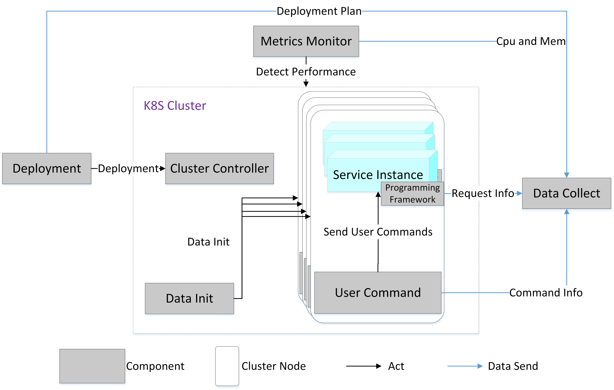
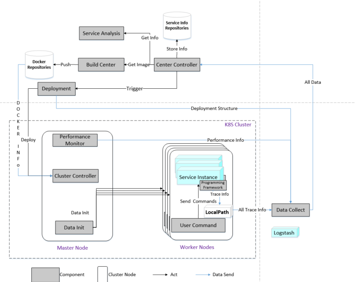

# 异味检测工具

## 内部组件
异味检测工具， 内部核心基于bal smell实证研究检测框

- MCenterControl:18080： 中控， 负责所有组件之间的调度

基础组件
- MCommon： 定义通用的类以及其他的配置信息
- MMontinor:18081： 性能检测工具， 可以检测pod 以及 node cpu以及mem的情况
- MClusterController:18082： k8s集群控制工具， 部署pod 发布服务用的
- MServiceAnalysis:18083： 分析各个微服务的详细信息
运行时的调度组件
- MDeployment:18084： 部署组件， 调用ClusterController 对集群进行部署操作（根据的是MService Analysis的服务信息）
- MDataInit:18085: 用于数据的初始化（针对的是复旦的系统， 各个系统不一致）
- MUSerCommand:18086： 发布用户需求，对系统进行压力的测试
- MDataCollect: 收集数据组件  
- MEmpiricalComparison： 用于实证对比， 得到的结果为 （主要是）

## 框架运行
主要分为两个框架： 一个实证研究框架， 用于检测bad smell的数据表征， 另一个为在其得到的数据表征上进行的数据分析，异味检测

### 实证研究框架: MRSTF

### 检测框架
整体的框架图

~~~shell
./build.sh
~~~